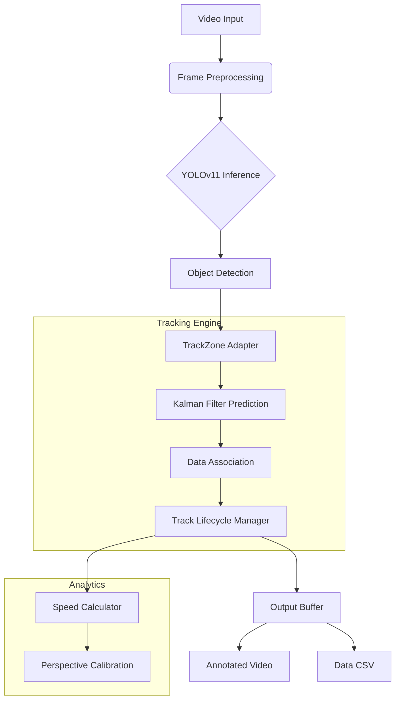

# 👁️ VisionTools
> **Advanced Computer Vision Pipeline for Traffic Analytics & Object Tracking**


<p align="center">
  
</p>

## 📋 Overview

**VisionTools** is a modular, production-ready computer vision system designed to extract meaningful insights from video feeds. Built with a focus on Clean Architecture and extensibility, it leverages state-of-the-art Deep Learning (YOLOv11) combined with classical computer vision algorithms to perform robust object tracking, speed estimation, and behavioral analysis.

This project demonstrates advanced engineering capabilities in **MLOps**, **Software Architecture**, and **Real-time Processing**.

---

## 🚀 Key Features

### 🎯 Precision Object Tracking
- **Hybrid Tracking Engine**: Combines **Kalman Filters** for motion prediction with **Color Histograms** for appearance re-identification.
- **Occlusion Handling**: Robust logic to maintain object identity through temporary obstructions.
- **Lifecycle Management**: Sophisticated state machine for track initialization, confirmation, and termination.

### ⚡ Intelligence & Analytics
- **Speed Estimation**: Implements homography transformation (perspective mapping) to convert pixel displacement into real-world velocity (km/h).
- **Multi-Class Detection**: Capable of distinguishing between cars, trucks, buses, motorcycles, and pedestrians.
- **Zone-Based Analysis**: Configurable regions of interest (ROI) for specific monitoring tasks.

### 🛠️ Engineering Excellence
- **Modular Architecture**: Components (Input, Output, Processing) are decoupled via Adapters, making the system highly testable and maintainable.
- **Configurable Pipeline**: Entire behavior driven by a centralized `config.json` file.
- **Dual Output**: Generates both visual overlays (Annotated Video) and structured data (CSV) for downstream analytics.

---

## 🏗️ System Architecture



---

## 💻 Getting Started

### Prerequisites
- Python 3.9+
- CUDA-compatible GPU (Recommended for real-time performance)

### Installation

1. **Clone the repository**
   ```bash
   git clone https://github.com/yourusername/visiontools.git
   cd visiontools
   ```

2. **Set up environment**
   ```bash
   # Create virtual environment
   python -m venv .venv
   source .venv/bin/activate  # Linux/Mac
   # .venv\Scripts\activate   # Windows
   
   # Install dependencies
   pip install -r requirements.txt
   ```

3. **Run the Analyzer**
   ```bash
   python main.py
   ```

---

## ⚙️ Configuration

The system is fully customizable via `config.json`:

- **`GEOMETRY_CONFIG`**: Define monitoring zones and calibration points.
- **`MODEL_CONFIG`**: Swap YOLO models and adjust confidence thresholds.
- **`TRACKING_CONFIG`**: Tune Kalman parameters for specific scenarios.

---

