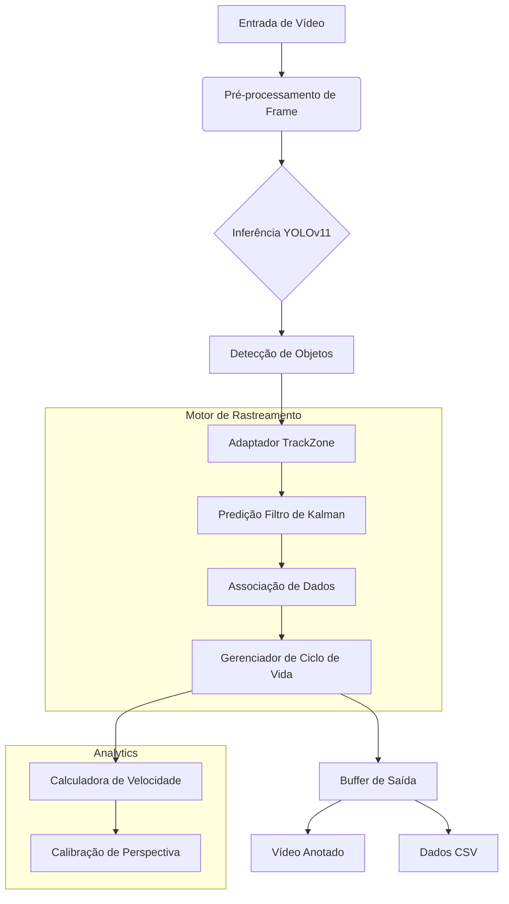

# 👁️ VisionTools
> **Pipeline de Visão Computacional Avançado para Análise de Tráfego e Rastreamento de Objetos**


## 📋 Visão Geral

**VisionTools** é um sistema de visão computacional modular e pronto para produção, projetado para extrair insights valiosos de feeds de vídeo. Construído com foco em Arquitetura Limpa (Clean Architecture) e extensibilidade, utiliza o estado da arte em Deep Learning (YOLOv11) combinado com algoritmos clássicos de visão computacional para realizar rastreamento robusto de objetos, estimativa de velocidade e análise comportamental.

Este projeto demonstra capacidades avançadas de engenharia em **MLOps**, **Arquitetura de Software** e **Processamento em Tempo Real**.

---

## 🚀 Funcionalidades Principais

### 🎯 Rastreamento de Objetos de Precisão
- **Motor de Rastreamento Híbrido**: Combina **Filtros de Kalman** para predição de movimento com **Histogramas de Cor** para reidentificação visual.
- **Tratamento de Oclusão**: Lógica robusta para manter a identidade dos objetos mesmo durante obstruções temporárias.
- **Gerenciamento de Ciclo de Vida**: Máquina de estados sofisticada para inicialização, confirmação e encerramento de rastreamentos.

### ⚡ Inteligência e Análise
- **Estimativa de Velocidade**: Implementa transformação de homografia (mapeamento de perspectiva) para converter deslocamento de pixels em velocidade real (km/h).
- **Detecção Multi-Classe**: Capaz de distinguir entre carros, caminhões, ônibus, motocicletas e pedestres.
- **Análise Baseada em Zonas**: Regiões de interesse (ROI) configuráveis para tarefas de monitoramento específicas.

### 🛠️ Excelência em Engenharia
- **Arquitetura Modular**: Componentes (Entrada, Saída, Processamento) desacoplados via Adaptadores, tornando o sistema altamente testável e sustentável.
- **Pipeline Configurável**: Todo o comportamento é controlado por um arquivo centralizado `config.json`.
- **Saída Dual**: Gera tanto sobreposições visuais (Vídeo Anotado) quanto dados estruturados (CSV) para análises posteriores.

---

## 🏗️ Arquitetura do Sistema



---

## 💻 Começando

### Pré-requisitos
- Python 3.9+
- GPU compatível com CUDA (Recomendado para desempenho em tempo real)

### Instalação

1. **Clone o repositório**
   ```bash
   git clone https://github.com/seuusuario/visiontools.git
   cd visiontools
   ```

2. **Configure o ambiente**
   ```bash
   # Criar ambiente virtual
   python -m venv .venv
   source .venv/bin/activate  # Linux/Mac
   # .venv\Scripts\activate   # Windows
   
   # Instalar dependências
   pip install -r requirements.txt
   ```

3. **Execute o Analisador**
   ```bash
   python main.py
   ```

---

## ⚙️ Configuração

O sistema é totalmente personalizável através do `config.json`:

- **`GEOMETRY_CONFIG`**: Defina zonas de monitoramento e pontos de calibração.
- **`MODEL_CONFIG`**: Troque modelos YOLO e ajuste limiares de confiança.
- **`TRACKING_CONFIG`**: Ajuste parâmetros de Kalman para cenários específicos.

---

